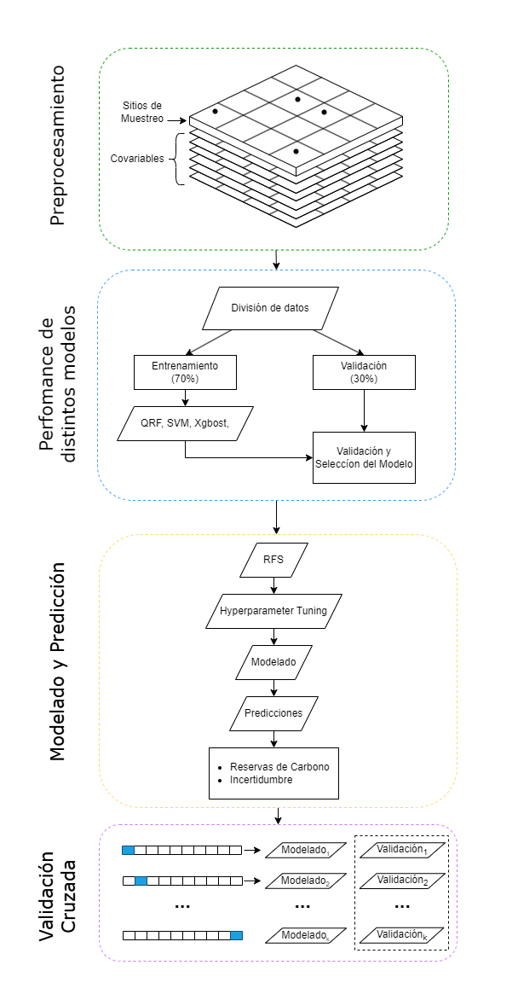

<h1 align="left">Hight Wetlands Carbon Stock Estimations</h1>

###

  

###

 

This repository includes the codes and workflow for the Carbon Stocks estimations in high weatlands.

# Modeling Workflow 

  

###

<h2 align="left">Lenguajes utlizados</h2>

###

  
  
  
  

###